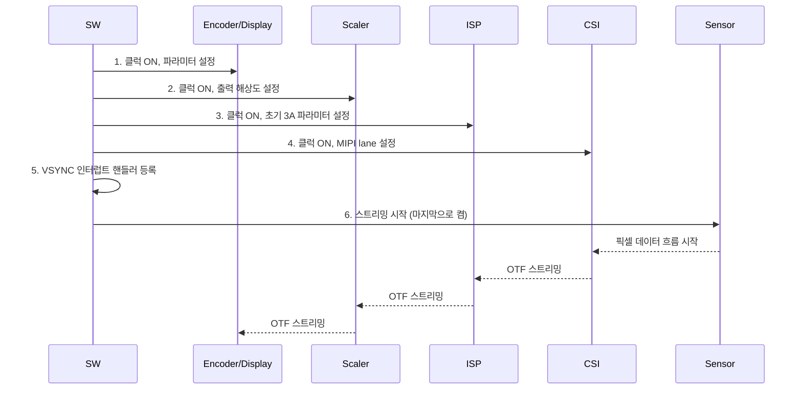
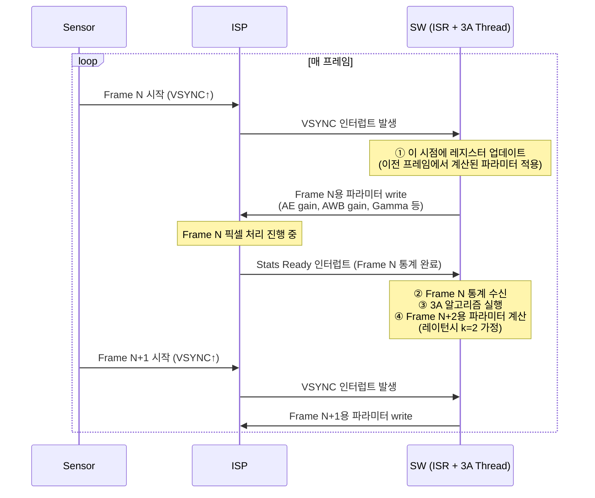
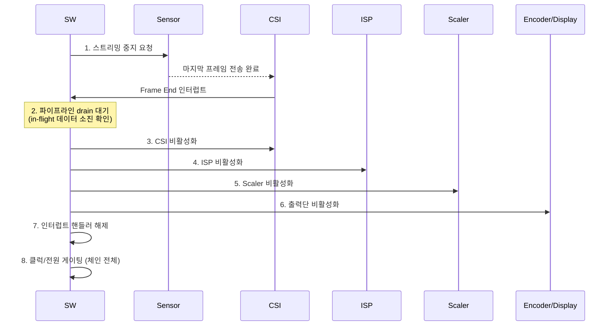
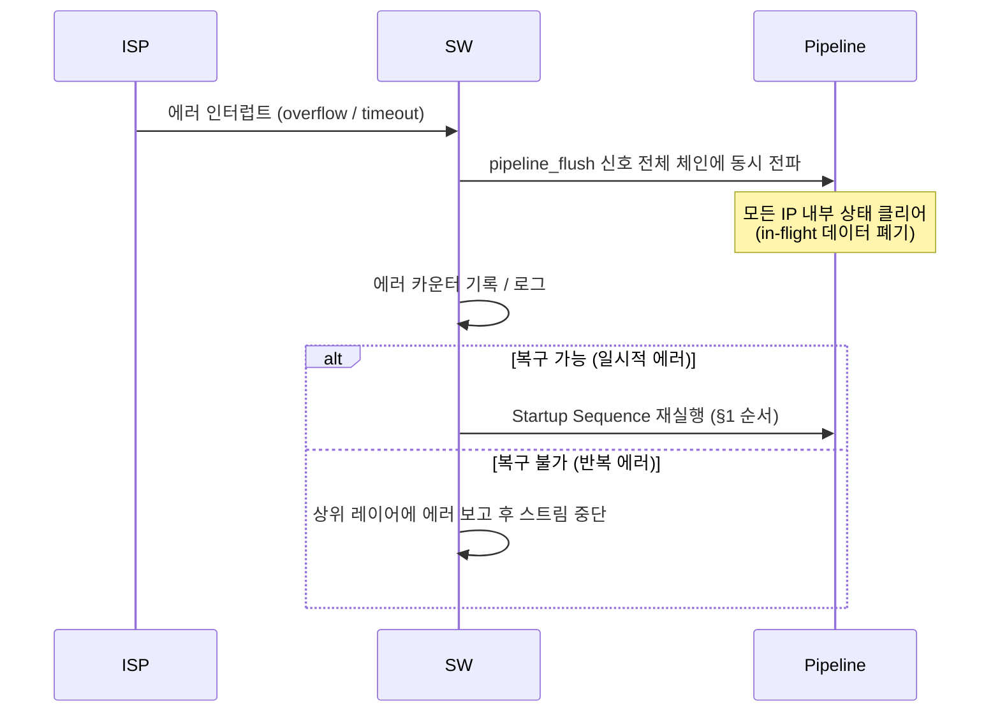

# SoC On-The-Fly (OTF): Sensor → AP 직접 연결 구조

Sensor에서 AP까지 중간 메모리(DRAM) 없이 IP 블록들이 스트리밍으로 직접 연결된 아키텍처.
메모리 대역폭·전력·레이턴시를 동시에 절감할 수 있으나, HW와 SW 양쪽에서 상당한 제약과 복잡도가 수반된다.

## 핵심 내용

### OTF란 무엇인가

**일반적인 구조 (메모리 경유):**
```
Sensor → CSI → ISP → DRAM → (SW 처리) → DRAM → Display / Encoder
```

**OTF 구조:**
```
Sensor → CSI → ISP → Scaler → Encoder / Display
                  ↑ 중간 DRAM 없이 직접 스트리밍
```

데이터가 한 IP에서 처리 완료되는 즉시 다음 IP로 흘러가는 파이프라인 방식.
픽셀 단위 또는 라인 단위로 전달되며, 어느 IP도 전체 프레임을 버퍼에 쌓지 않는다.

### 왜 쓰는가

| 항목 | 메모리 경유 | OTF |
|---|---|---|
| DRAM 대역폭 | 프레임마다 읽기/쓰기 발생 | 해당 구간 없음 |
| 레이턴시 | DRAM 왕복 수 ms | IP 파이프라인 딜레이만 (수십 ns~수 μs) |
| 전력 | DRAM 접근 = 고비용 | 절감 |
| 실시간성 | 버퍼링으로 완충 가능 | 흐름이 끊기면 파이프라인 전체 정지 |

모바일·차량용 카메라 SoC에서 고해상도(4K/8K) 실시간 처리, 저전력 요구가 맞물려 OTF 구조가 필수화되는 추세.

---

## HW 설계 시 주의사항

### 1. 백프레셔(Backpressure) 처리

OTF 체인에서 하류(downstream) IP가 데이터를 소화하지 못하면 상류(upstream) IP는 **즉시 멈춰야** 한다.
- 모든 IP 인터페이스가 `valid/ready` 핸드셰이킹(AXI-Stream 등)을 지원해야 함
- 백프레셔를 무시하는 IP가 하나라도 있으면 데이터 유실 또는 프레임 손상 발생
- CSI 수신단은 센서에서 지속적으로 픽셀이 들어오므로 백프레셔 전파 한계가 존재 → 소규모 라인 버퍼 삽입이 현실적

### 2. 클럭 도메인 경계(CDC, Clock Domain Crossing)

센서·ISP·인코더 등이 각기 다른 클럭을 쓰는 경우가 많음.
- CDC FIFO 삽입 시 이것이 유일한 메모리 요소가 되므로 깊이(depth) 결정이 중요
- 깊이가 너무 얕으면 오버플로, 너무 깊으면 레이턴시 증가 및 OTF 이점 감소

### 3. 타이밍 예산(Timing Budget)

각 IP의 처리 지연이 픽셀 클럭 주기 이내여야 함.
- 파이프라인 단계 수가 늘어날수록 총 지연 누적
- 고해상도일수록 픽셀 클럭 주기가 짧아져 마진 감소
- IP별 최대 처리 사이클 수를 사전에 명세해 합산 검증 필요

### 4. 에러 전파 및 리셋 설계

한 IP에서 에러 발생 시 체인 전체를 동기적으로 리셋해야 함.
- 비동기 리셋이 각 IP에 개별 전파되면 파이프라인 내 데이터 정합성 깨짐
- 공통 `pipeline_flush` 신호로 전체 IP를 동시 클리어하는 설계 권장

### 5. 부분 OTF / 하이브리드 구조

모든 구간을 OTF로 연결하기 어려운 경우, 전략적으로 메모리 경유 지점을 선택.
```
Sensor → [OTF] → ISP → [OTF] → Scaler → DRAM → Encoder
                                          ↑
                              여기만 메모리 경유 (인코더 입력 버퍼링 필요 시)
```

---

## SW 설계 시 주의사항

### 1. 프레임 단위 제어 불가

메모리 경유 구조에서는 SW가 DRAM의 프레임 버퍼를 읽어 언제든 접근·수정 가능.
OTF에서는 데이터가 이미 흘러간 뒤이므로 **SW가 중간 프레임에 개입할 수 없다**.

- 파라미터 변경(노출값, 화이트밸런스, 3A 결과 적용 등)은 **프레임 경계(frame boundary)** 에서만 가능
- ISP 레지스터 업데이트 타이밍을 VSYNC 인터럽트와 정확히 동기화해야 함
- 잘못된 타이밍에 레지스터를 쓰면 한 프레임 내에서 파라미터가 도중 변경되는 **tear 현상** 발생

### 2. 파이프라인 레이턴시 인식

OTF 파이프라인에는 고유한 전파 지연이 있음.
- SW가 파라미터를 N번째 프레임에 적용해도 실제 효과는 N+k번째 프레임에 나타남 (k = 파이프라인 깊이)
- 3A(Auto Exposure/White Balance/Focus) 알고리즘은 이 레이턴시를 모델에 반영해야 함
- 레이턴시를 무시하면 3A 루프가 발진(oscillation)하거나 수렴 속도가 느려짐

### 3. 통계(Statistics) 데이터 수집 시점

OTF 파이프라인 내 ISP가 생성하는 AE/AWB 통계는 **현재 흐르는 프레임의 것**.
- 통계 수집 완료 인터럽트가 발생하는 시점과 해당 프레임의 DRAM 저장 시점이 다름
- 통계 기반으로 계산한 파라미터를 적용할 타겟 프레임 번호를 명확히 추적해야 함 (frame ID 매핑)

### 4. 다중 경로(Multi-Path) 분기 처리

하나의 센서 스트림에서 OTF로 Preview / Video / Still 경로를 분기할 때:
- 분기 후 각 경로의 처리 속도가 다르면 백프레셔 충돌 발생
- SW에서 경로별 우선순위·드롭 정책을 명시적으로 설정해야 함
- 특정 경로를 비활성화할 때 파이프라인 전체를 멈추지 않고 해당 브랜치만 드레인(drain)하는 절차 필요

### 5. 디버깅 어려움

메모리 경유 구조에서는 DRAM 덤프로 중간 결과를 확인 가능.
OTF에서는 중간 결과가 DRAM에 없음.
- 디버그용 **캡처 포인트(capture tap)** 를 HW에 미리 설계해 두어야 함
- SW는 디버그 모드 시 특정 구간을 메모리 경유로 우회(bypass)하는 경로를 제공해야 함
- 이 우회 경로를 처음부터 설계에 포함하지 않으면 현장 디버깅이 극도로 어려워짐

### 6. 전력 관리(PM)와의 충돌

OTF 체인 내 IP는 독립적으로 클럭 게이팅·파워 게이팅하기 어렵다.
- 한 IP를 끄면 체인 전체가 멈추므로, PM 정책은 **체인 단위**로 설계해야 함
- 런타임 DVFS(Dynamic Voltage/Frequency Scaling) 적용 시 전체 체인의 타이밍 예산을 다시 검증해야 함

---

## 권장 SW Control Sequence

### 1. 파이프라인 초기화 (Startup)

> **핵심 원칙**: 초기화는 반드시 **하류(downstream) → 상류(upstream)** 순서로.
> 하류 IP가 준비되기 전에 상류를 켜면 첫 프레임 데이터가 백프레셔 없이 유실된다.



---

### 2. 런타임 프레임 제어 루프 (Per-Frame Control)

OTF에서 SW는 **VSYNC 경계**에서만 레지스터를 안전하게 업데이트할 수 있다.



---

### 3. 3A 레이턴시 타이밍 모델

OTF 파이프라인 깊이(k)만큼 파라미터 적용이 지연된다.
아래는 k=2인 일반적인 모바일 카메라 SoC 예시.

```
프레임 번호:  |  N  |  N+1  |  N+2  |  N+3  |
─────────────────────────────────────────────────────
Sensor 노출:  | E[N]| E[N+1]| E[N+2]| E[N+3]|
              |     |       |       |       |
ISP 처리:     | ←N→ | ←N+1→ | ←N+2→ |       |
              |     |       |       |       |
Stats 수신:   |     |  S[N] |S[N+1] |S[N+2] |  ← Frame N 통계는 N+1에 도착
              |     |       |       |       |
3A 계산:      |     | calc  | calc  | calc  |  ← S[N]으로 E[N+2]를 결정
              |     |       |       |       |
파라미터 적용:|     |       | E[N+2]|       |  ← N+1 VSYNC에 write → N+2에 반영
```

> SW는 `frame_id`를 키로 (stats_frame, target_frame)을 쌍으로 추적해야 한다.
> `target_frame = stats_frame + k` (k는 파이프라인별 실측값으로 보정 필요)

---

### 4. 파이프라인 종료 (Shutdown)

> **핵심 원칙**: 종료는 **상류 → 하류** 순서로, 파이프라인이 완전히 비워진(drain) 뒤 각 IP를 끈다.



---

### 5. 에러 복구 Sequence

IP 내부 에러(overflow, timeout 등) 발생 시 partial 리셋이 아닌 **전체 체인 재시작**이 안전하다.



---

## 관련 맥락

- **AXI-Stream**: OTF 인터페이스로 가장 많이 쓰이는 ARM 표준 스트리밍 버스
- **CSI (Camera Serial Interface)**: 센서와 SoC 사이의 물리 인터페이스. MIPI CSI-2가 표준
- **ISP (Image Signal Processor)**: OTF 체인의 핵심 처리 IP. 노이즈 제거, 디모자이킹, 톤 매핑 등 수행
- **3A 알고리즘**: Auto Exposure, Auto White Balance, Auto Focus. OTF 레이턴시 모델링이 필수
- **V4L2 / Media Controller**: Linux에서 OTF 카메라 파이프라인을 제어하는 커널 서브시스템

## 변경 이력

- 2026-04-21: 최초 생성 (출처: 사용자 구술 지식)
- 2026-04-21: SW control sequence 다이어그램 5종 추가 (Startup / Per-Frame Loop / 3A 레이턴시 모델 / Shutdown / 에러 복구)
