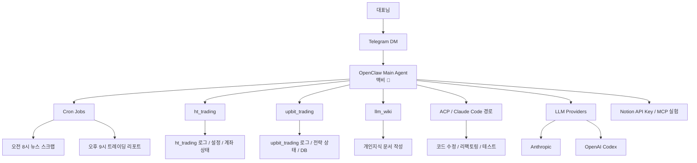
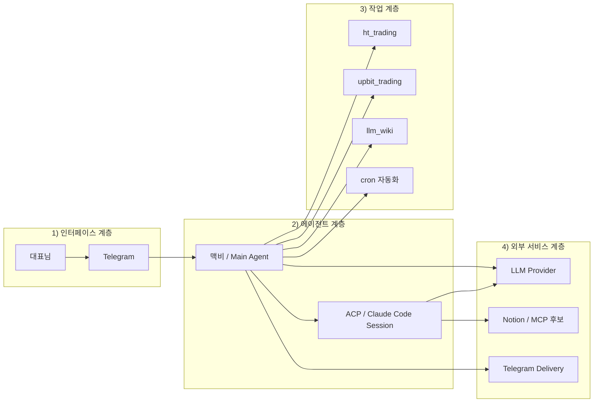
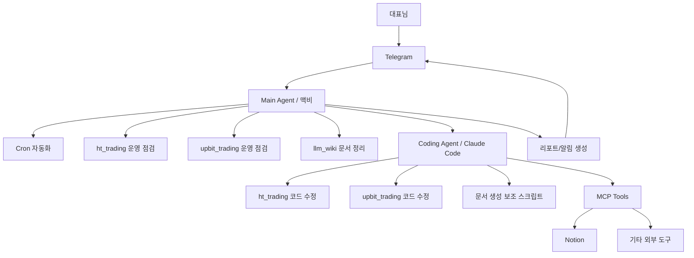

# OpenClaw 에이전트 아키텍처 (현재 구조 + 확장 방향)

이 문서는 현재 대표님 컴퓨터에서 운영 중인 OpenClaw 중심 에이전트 구조를 정리하고, 앞으로 확장할 때 어떤 방식으로 구성하는 것이 좋은지 설명한다.

핵심 목적은 다음 3가지다.

1. **현재 구조를 한눈에 파악하기**
2. **메시지/작업/자동화 흐름을 분리해서 이해하기**
3. **향후 coding agent, Notion 연동, 지식관리 자동화까지 확장 가능한 구조로 정리하기**

---

# 1. 한 줄 요약

현재 구조는 다음과 같다.

- **대표님 → Telegram → OpenClaw 메인 에이전트(맥비)**
- 맥비는
  - 일반 대화
  - cron 자동화
  - 로컬 프로젝트 점검
  - 코드 수정 요청 중계
  - 보고/알림
  을 담당한다.
- 로컬 작업 대상은 주로
  - `ht_trading`
  - `upbit_trading`
  - `llm_wiki`
  이다.
- 코딩 작업은 장기적으로 **ACP/Claude Code 전용 세션**으로 분리하는 것이 적합하다.

---

# 2. 현재 구조 다이어그램

## 2.1 시스템 구성도

---

## 2.2 계층별 구조

---

# 3. 현재 구성 요소 설명

## 3.1 대표님
대표님은 Telegram을 통해 맥비를 호출한다. 직접 터미널을 열지 않고도:

- 질문
- 점검 요청
- 코드 수정 지시
- 문서 정리
- 자동화 요청

을 자연어로 지시할 수 있다.

즉, 대표님은 **오케스트레이터에게 요청을 보내는 사람**이고, 맥비는 이를 적절한 작업 경로로 분기한다.

---

## 3.2 Telegram
현재 대표적인 상호작용 채널이다.

역할:
- 대표님 ↔ 맥비 간 대화 인터페이스
- cron 결과 수신
- 트레이딩/뉴스 리포트 수신
- 운영 점검 알림 수신

Telegram은 단순 채팅창이 아니라 **대표님 개인 에이전트 운영 콘솔**에 가깝다.

---

## 3.3 OpenClaw Main Agent = 맥비
현재 구조의 중심이다.

주요 역할:
- 일반 질의응답
- 로컬 파일 읽기/쓰기
- 프로젝트 점검
- 설정 확인
- cron 등록 및 수동 실행
- 트레이딩 봇 상태 점검
- 위키 문서 작성 보조
- 코드 수정 작업의 중계자 역할

즉 맥비는 **대표님과 가장 가까운 범용 개인 비서이자 라우터**다.

---

## 3.4 cron 자동화
현재 메인 운영 자동화는 cron이 담당한다.

예:
- **오전 8시 뉴스 스크랩**
- **오후 9시 트레이딩 분석 리포트**

이 구조는 아주 중요하다. 왜냐하면 맥비가 “항상 기다리는 채팅봇” 역할만 하는 것이 아니라,
**정해진 시점에 능동적으로 리포트를 전달하는 자동화 에이전트**로 동작하기 때문이다.

---

## 3.5 ht_trading
국내 주식 자동매매 프로젝트.

주요 관리 대상:
- 로그
- 실거래 동작 여부
- 포지션 상태
- 리스크 설정
- API 안정성
- 텔레그램 알림 여부

맥비는 대표님 요청 시:
- 동작 여부 확인
- 로그 분석
- 설정 반영 확인
- 리포트 작성
- 재시작
등을 수행한다.

즉 `ht_trading`은 **운영 대상 시스템**이다.

---

## 3.6 upbit_trading
업비트 기반 암호화폐 자동매매 프로젝트.

주요 관리 대상:
- 매수/매도 로직 상태
- 하락장 감지 필터
- 쿨다운 설정
- DB/로그 확인
- 일일 리포트 분석

특히 이 프로젝트는 대표님이 전략 완화/강화 실험을 자주 하므로,
맥비가 **로그 분석 + 설정 반영 여부 확인** 용도로 자주 관여한다.

---

## 3.7 llm_wiki
대표님의 개인 지식관리 저장소.

역할:
- 강의 요약 정리
- 실전 학습 문서 축적
- 개념 문서화
- 에이전트/Claude Code/OpenClaw 관련 지식 구조화

이 저장소는 단순 메모장이 아니라,
대표님의 **장기 지식 자산**이 되는 공간이다.

---

## 3.8 ACP / Claude Code 경로
현재는 완전히 안정화되진 않았지만,
장기적으로는 **코딩 작업 전용 실행 경로**가 된다.

역할:
- 코드 수정
- 리팩토링
- 테스트
- 커밋
- 멀티파일 작업

중요한 점은 맥비가 직접 모든 코드를 치는 것보다,
이 경로를 통해 **전용 coding agent** 에게 일을 맡기는 구조가 더 확장성이 좋다는 점이다.

---

# 4. 현재 구조의 장점

## 4.1 메인 비서 역할이 명확하다
대표님은 그냥 맥비에게 말하면 된다.

- 점검해줘
- 정리해줘
- 로그 봐줘
- 설정 반영됐는지 확인해줘

맥비가 이것을 내부적으로 분기한다.

---

## 4.2 운영 대상 시스템이 분명하다
현재 대표님의 실질적 운영 대상은 크게 3가지다.

- 트레이딩 운영 (`ht_trading`)
- 트레이딩 운영 (`upbit_trading`)
- 지식 관리 (`llm_wiki`)

그래서 아키텍처도 복잡해 보이지만 실제론 꽤 정돈된 편이다.

---

## 4.3 자동화 축이 이미 있다
cron이 있기 때문에 맥비는 단순 반응형 에이전트가 아니라,
**주기적으로 일하는 자동화 에이전트**로 진화한 상태다.

---

# 5. 현재 구조의 한계

## 5.1 메인 에이전트에 역할이 몰려 있다
현재는 맥비가 너무 많은 역할을 동시에 담당한다.

- 대화
- 점검
- 리포트
- 설정 변경
- 문서 작성
- 코딩 작업 중계

이 구조는 초반엔 편하지만,
장기적으로는 문맥이 섞이고 복잡도가 올라간다.

---

## 5.2 코딩 경로가 아직 불안정하다
ACP / Claude Code는 장기적으로 매우 중요하지만,
현재는 런타임 안정성 문제가 남아 있다.

즉 구조상 맞는 방향이지만,
실전에서는 **신뢰성 확보가 아직 필요**하다.

---

## 5.3 Notion 연동은 아직 실험 단계다
API 키와 MCP 설정 시도는 있었지만,
현재는 메인 세션에서 바로 쓰는 구조까지는 완성되지 않았다.

즉 Notion은 아직 **아키텍처에 들어갈 예정인 외부 지식 서비스** 수준이다.

---

# 6. 앞으로의 확장 방향

## 6.1 추천 방향: 2-Agent 구조
가장 현실적인 확장 방향은 아래다.

### A. Main Agent (맥비)
역할:
- 대표님과 직접 대화
- Telegram 인터페이스
- cron/리포트/일반 점검
- 위키 문서 작성 보조
- 코딩 작업 지시 전달

### B. Coding Agent (ACP / Claude Code)
역할:
- 코드 수정
- 리팩토링
- 테스트
- 커밋
- 프로젝트 탐색

즉,
**대표님 ↔ 맥비 ↔ Coding Agent** 구조가 가장 이상적이다.

---

## 6.2 확장 구조 다이어그램

---

# 7. 향후 추천 우선순위

## 1순위: 코딩 전용 에이전트 안정화
대표님 환경에서 가장 큰 생산성 향상 포인트는 이것이다.

이유:
- 파일 탐색
- 멀티파일 수정
- 테스트
- 커밋
을 메인 문맥과 분리할 수 있기 때문

---

## 2순위: 운영 리포트 고도화
특히 트레이딩 봇은 이미 운영 중이므로,
리포트 품질을 높이는 것이 직접적인 체감효과가 크다.

예:
- 포지션 상태 스냅샷
- 미체결 요약
- API 안정성 요약
- 매매 영향도 분석

---

## 3순위: 지식관리 자동화 연계
`llm_wiki`와 외부 지식 저장소(Notion 등)를 연결하면,
대표님의 학습/업무 자산이 더 정돈될 수 있다.

하지만 이건 코딩 에이전트와 운영 자동화가 안정화된 뒤 붙이는 것이 좋다.

---

# 8. 대표님용 최종 정리

현재 대표님 컴퓨터의 에이전트 구조는 다음처럼 이해하면 된다.

- **대표님은 Telegram으로 맥비를 호출한다**
- **맥비는 메인 에이전트로서 모든 요청의 관제탑 역할을 한다**
- **실제 운영 대상은 `ht_trading`, `upbit_trading`, `llm_wiki`다**
- **cron은 정기 자동화 레이어다**
- **코딩은 장기적으로 Claude Code 기반 coding agent로 분리하는 것이 맞다**
- **Notion/MCP 같은 외부 연동은 이후 확장 레이어다**

즉 현재 구조는 이미 꽤 좋은 출발점이며,
앞으로는 **메인 에이전트 + 코딩 전용 에이전트**의 2계층 구조로 발전시키는 것이 가장 자연스럽다.

---

# 9. 나의 적용 포인트

- 메인 에이전트는 대표님 인터페이스 중심으로 유지한다.
- 코딩 작업은 별도 coding agent로 분리해야 문맥이 덜 섞인다.
- `ht_trading`, `upbit_trading`, `llm_wiki`는 현재 구조의 핵심 운영 자산이다.
- cron은 단순 예약이 아니라 대표님 개인 에이전트의 능동성 레이어다.
- 향후 구조 개선의 핵심은 “툴 추가”보다 “역할 분리”다.

---

# 변경 이력

- 2026-04-17: 현재 대표님 컴퓨터의 OpenClaw 에이전트 구조와 확장 방향을 Mermaid 다이어그램 포함 문서로 정리
